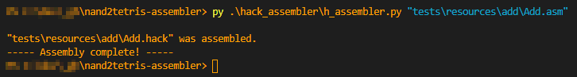

This is a Hack-language Assembler made in Python.

It translates this:
```
@2
D=A
@3
D=D+A
@0
M=D
```

into that:
```
0000000000000010
1110110000010000
0000000000000011
1110000010010000
0000000000000000
1110001100001000
```

and this is how you use it:


---
